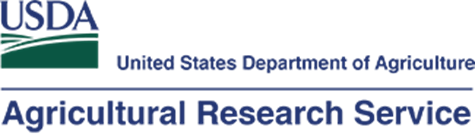

<!-- README.md is generated from README.Rmd. Please edit that file -->

```{r, echo = FALSE}
knitr::opts_chunk$set(
  collapse = TRUE,
  comment = "#>",
  fig.path = "README-"
)

```
<!-- ****** Description ****** -->

This repository contains the code that will be used for the 2023 ICRW8 workshop (https://icrwatersheds.org/icrw8/icrw8-schedule/june-5-workshops/). This workshop involves retrieving data from the STEWARDS database (https://www.nrrig.mwa.ars.usda.gov/stewards/stewards.html) and NEON data portal (https://data.neonscience.org/). Participants will then use a combination of excel and R software to merge the datasets and compare water quality parameters at two nearby Georgia rivers, the Little River and Flint River. Spreadsheets and code used for the workshop will be available on GitHub for reference before and after the workshop.

<!-- ****** Organizers ****** -->

Organized by Oliva Pisani (USDA-ARS), Jim Coloso (NEON), Bobby Hensley (NEON), and Kaelin Cawley (NEON).

<!-- ****** Prep ****** -->
## Preparation for the workshop
1. Optional, but very helpful! Create an API token using the instructions in the following tutorial, which shouldn't take more than 10 minutes (https://www.neonscience.org/resources/learning-hub/tutorials/neon-api-tokens-tutorial)
2. Ensure that you have a recent R version installed on your computer. (Tutorial leaders will have version >= 4.2.0)
3. The tutorial leaders will use RStudio, which is also recommended, but optional.
4. Install required packages: `neonUtilities`, `plotly`, and `lubridate`. You can run the following to install all the packages: install.packages(c('neonUtilities','plotly','lubridate'))

<!-- ****** Agenda ****** -->
## Agenda for the June 5th, 2023 workshop
1. 25 minute introduction to NEON, USDA ARS, and the Flint River and Little River sites 
2. 35 minutes for Manual data downloads
3. 10 minute break
4. 60 minutes live coding tutorial in R: NEON downloading data, processing, and plotting
5. 10 minute break
6. 60 minute live coding tutorial in R: USDA data, processing, and plotting. Comparison of rivers, C-Q plots
7. 40 minutes for project-specific questions and social time

<!-- ****** Intro Links ****** -->
## Introduction Links

USDA FTP site for water chemistry and metadata: https://cloud.tiftonars.org/index.php/s/Z5eBDj976kseBRY?path=%2FDatabases%2FPisani%20Workshop%20Data

USDA FTP site for stream discharge: https://cloud.tiftonars.org/index.php/s/Z5eBDj976kseBRY?path=%2FDatabases%2FLREW%2Fstreamflow%2Fdaily

Getting started with NEON data: https://www.neonscience.org/resources/getting-started-neon-data-resources

Contact us form: https://www.neonscience.org/about/contact-us

Teaching Modules: https://www.neonscience.org/resources/learning-hub/teaching-modules <br />
QUBES modules: https://qubeshub.org/community/groups/neon/educational_resources <br />
EDDIE modules : https://serc.carleton.edu/eddie/macrosystems/index.html

Spatial data and maps: https://neon.maps.arcgis.com/home/index.html

<!-- Flint River NEON (FLNT) site page: https://www.neonscience.org/field-sites/flnt  <br /> -->
<!-- Note: Just substitute the 4-letter site code at the end of the url to see any other site page. -->

NEON data portal: https://data.neonscience.org/

NEONScience GitHub repo: https://github.com/NEONScience <br />
ICRW8 2023 Workshop GitHub repo: https://github.com/NEONScience/WORKSHOP-ICRW8-2023

<!-- ****** Usage ****** -->
## Usage
This repository is designed to be used with NEON data as part of a live tutorial taking place June 5th, 2023 (https://icrwatersheds.org/icrw8/icrw8-schedule/june-5-workshops/).<br />

Participants are required to agree and adhere to [NEON's Code of Conduct](NEON Code of Conduct.pdf).

<!-- ****** Acknowledgements ****** -->
## Credits & Acknowledgements

<!-- HTML tags to produce image, resize, add hyperlink. -->
<!-- ONLY WORKS WITH HTML or GITHUB documents -->
<a href="http://www.neonscience.org/">

</a>

<!-- Acknowledgements text -->
The National Ecological Observatory Network is a project solely funded by the National Science Foundation and managed under cooperative agreement by Battelle. Any opinions, findings, and conclusions or recommendations expressed in this material are those of the author(s) and do not necessarily reflect the views of the National Science Foundation.

<a href="https://www.ars.usda.gov/">

</a>

<!-- Acknowledgements text -->
The Agricultural Research Service (ARS) is the U.S. Department of Agriculture's chief scientific in-house research agency. Our job is finding solutions to agricultural problems that affect Americans every day from field to table.

<!-- ****** License ****** -->
## License

CC0 1.0 Universal


<!-- ****** Disclaimer ****** -->
## Disclaimer

*Information and documents contained within this page are available as-is. Codes or documents, or their use, may not be supported or maintained under any program or service and may not be compatible with data currently available from the NEON Data Portal.*